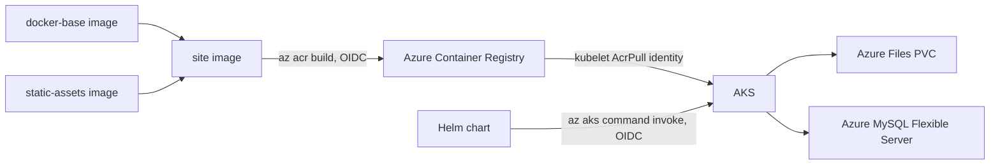

# ☁️ Azure WordPress on AKS

A containerized WordPress deployment for Azure Kubernetes Service - the application layer for the [azure-wordpress-aks-infra](https://github.com/chinmaymjog/azure-wordpress-aks-infra) platform. WordPress is the reference workload; the point of this repo is the platform pattern around it: a layered container build, a Helm chart driving Kubernetes deployment, and GitHub Actions CI/CD that builds, pushes, and deploys with no static cloud credentials.

## 📦 Structure

```
containers/
  docker-base/     # Hardened WordPress + PHP-FPM/Apache runtime image
  static-assets/    # Common pool of themes/plugins, packaged separately
                     # so content updates don't require rebuilding the base
charts/
  Dockerfile         # Site image: docker-base + static-assets + this site's
                      # own wp-content
  deploy/             # The Helm chart itself
  src/                 # This site's wp-config.php and wp-content overrides
  pkg-mgr/              # Which of static-assets' plugins/themes this site ships
scripts/
  db-create, db-dump, db-restore,       # MySQL lifecycle
  fileshare-create, file-upload,        # Azure Files provisioning
  container-create, assets-sync         # Blob snapshot storage, env-to-env asset sync
.github/workflows/
  build.yml    # Builds & pushes all three images to ACR (az acr build, OIDC)
  deploy.yml   # helm upgrade --install onto AKS (az aks command invoke, OIDC)
```

See each subdirectory's own README for details. The companion
[azure-wordpress-aks-infra](https://github.com/chinmaymjog/azure-wordpress-aks-infra)
repo provisions everything this deploys onto: the AKS cluster, ACR, and
managed MySQL database.

## 🏗️ How It Fits Together



- Images are pushed via `az acr build` - the build happens on ACR's own build service, not the CI runner, and there's no registry password to manage.
- AKS pulls images via its kubelet identity's `AcrPull` role (see the infra repo) - no image pull secret needed for the default path.
- Deploys run via `az aks command invoke`, which executes `helm upgrade` from inside the cluster's control plane through the Azure API. This matters because the infra repo's AKS API server has `authorized_ip_ranges` configured, and GitHub-hosted runners have no fixed IP to allowlist - `command invoke` needs no direct network path to the API server at all.
- WordPress uploads persist on an Azure Files share mounted as a PVC, shared across the web replicas.

## 🚀 Local Development

```bash
cd charts
docker compose up --build
```

Brings up MySQL and the site image locally at `http://localhost`. This
builds `charts/Dockerfile` directly, which by default pulls its base
images from GHCR (`ghcr.io/chinmaymjog/azure-wordpress-aks/...`) - override
with `--build-arg` if you're pointing at your own registry.

## 🔄 CI/CD Setup

Both workflows authenticate via OIDC - no client secret stored in GitHub. One-time setup:

1. **Azure AD App Registration with a federated credential** (see the infra repo's README for the exact `az ad app`/`federated-credential` commands - reuse the same app registration for both repos, or create a separate one scoped just to ACR push + `az aks command invoke`).
2. **Repository secrets**: `ARM_CLIENT_ID`, `ARM_TENANT_ID`, `ARM_SUBSCRIPTION_ID`, `DB_PASSWORD`, `STORAGE_ACCOUNT_KEY`.
3. **Repository variables** (Settings > Secrets and variables > Actions > Variables), from the infra repo's `terraform output`:
   - `ACR_NAME` (`terraform output acrname` in `hub/`)
   - `AKS_NAME`, `AKS_RESOURCE_GROUP` (`terraform output` in `aks/`)
   - `DB_HOST`, `DB_ADMIN_USER` (`terraform output` in `database/`)
   - `STORAGE_ACCOUNT_NAME` (`terraform output storage_account_name` in `database/`)
   - `PVC_FILESHARE`, `SITE_DOMAIN` - your own values.
4. **Build**: push to `main`/`develop` or tag `v*.*.*` triggers `build.yml`.
5. **Deploy**: run `deploy.yml` manually from the Actions tab with the image tag `build.yml` produced. `main` deploys to `preprod`, a version tag deploys to `prod`, anything else deploys to `dev` - each behind its own GitHub Environment, so you can gate `prod` with required reviewers under Settings > Environments.

## 🛡️ License
Distributed under the MIT License. See `LICENSE` in each subdirectory.

---
*Maintained by [Chinmay Jog](https://github.com/chinmaymjog) | 📖 [Read my articles on Medium](https://medium.com/@chinmaymjog)*
