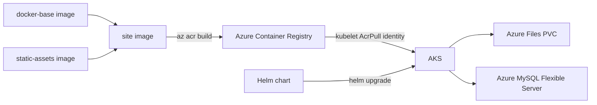

# ☁️ Azure WordPress on AKS

A containerized WordPress deployment for Azure Kubernetes Service - the application layer for the [azure-wordpress-aks-infra](https://github.com/chinmaymjog/azure-wordpress-aks-infra) platform. WordPress is the reference workload; the point of this repo is the platform pattern around it: a layered container build and a Helm chart driving Kubernetes deployment.

## System Docs

- Project specification: [docs/project-spec.md](docs/project-spec.md)
- Architecture decisions: [docs/architecture.md](docs/architecture.md)
- Execution tracker: [docs/tasks.md](docs/tasks.md)

## 📦 Structure

```
containers/
  docker-base/     # Hardened WordPress + PHP-FPM/Apache runtime image
  static-assets/    # Common pool of themes/plugins, packaged separately
                     # so content updates don't require rebuilding the base
charts/
  Dockerfile         # Site image: docker-base + static-assets + this site's
                      # own wp-content
  deploy/             # The Helm chart itself
  src/                 # This site's wp-config.php and wp-content overrides
  pkg-mgr/              # Which of static-assets' plugins/themes this site ships
scripts/
  db-create, db-dump, db-restore,       # MySQL lifecycle
  fileshare-create, file-upload,        # Azure Files provisioning
  container-create, assets-sync         # Blob snapshot storage, env-to-env asset sync
.github/workflows/
  verify.yml   # helm lint + helm template on every push/PR - no cloud
                # credentials needed
```

See each subdirectory's own README for details. The companion
[azure-wordpress-aks-infra](https://github.com/chinmaymjog/azure-wordpress-aks-infra)
repo provisions everything this deploys onto: the AKS cluster, ACR, and
managed MySQL database.

Want automated CI/CD instead of running the commands below by hand? Check
out the [`advanced` branch](https://github.com/chinmaymjog/azure-wordpress-aks/tree/advanced)
- GitHub Actions workflows that build/push/deploy via OIDC, with a
dev/preprod/prod environment model.

## 🏗️ How It Fits Together



- AKS pulls images via its kubelet identity's `AcrPull` role (see the infra repo) - no image pull secret needed.
- WordPress uploads persist on an Azure Files share mounted as a PVC, shared across web replicas.

## 🚀 Local Development

```bash
cd charts
docker compose up --build
```

Brings up MySQL and the site image locally at `http://localhost`. This
builds `charts/Dockerfile` directly, which by default pulls its base
images from GHCR (`ghcr.io/chinmaymjog/azure-wordpress-aks/...`) - override
with `--build-arg` if you're pointing at your own registry.

## ☁️ Deploy to Your AKS Cluster

Once [azure-wordpress-aks-infra](https://github.com/chinmaymjog/azure-wordpress-aks-infra)
is deployed, get its outputs first:
```bash
# from the infra repo
ACR_NAME=$(cd hub && terraform output -raw acrname)
DB_HOST=$(cd database && terraform output -raw mysql_fqdn)
STORAGE_ACCOUNT=$(cd database && terraform output -raw storage_account_name)
```

### 1. Build & push the three images
```bash
az acr build --registry "$ACR_NAME" --image docker-base:latest containers/docker-base
az acr build --registry "$ACR_NAME" --image static-assets:latest containers/static-assets
cd charts
az acr build --registry "$ACR_NAME" --image wordpress:latest \
  --build-arg STATIC_ASSETS_IMAGE="$ACR_NAME.azurecr.io/static-assets:latest" \
  --build-arg DOCKER_BASE_IMAGE="$ACR_NAME.azurecr.io/docker-base:latest" \
  .
cd ..
```

### 2. Create the Azure Files share for WordPress uploads
```bash
STORAGE_KEY=$(az storage account keys list --account-name "$STORAGE_ACCOUNT" --query '[0].value' -o tsv)
./scripts/fileshare-create --staccount "$STORAGE_ACCOUNT" --stkey "$STORAGE_KEY" --stfileshare wordpress --dir uploads
```

### 3. Deploy with Helm
```bash
az aks get-credentials --resource-group rg-aks-<project>-main-weu --name aks-<project>-main-weu

helm upgrade --install wordpress ./charts/deploy \
  --namespace wordpress --create-namespace \
  --set app.image.registry="$ACR_NAME.azurecr.io" \
  --set app.image.repository=wordpress \
  --set app.image.tag=latest \
  --set app.pvc.share=wordpress \
  --set app.hosts[0].host=<your-domain-or-nip.io-address> \
  --set database.db_host="$DB_HOST" \
  --set database.db_name=wordpress \
  --set database.db_user=<db-admin-user-from-infra-output> \
  --set database.db_pass=<db-admin-password-from-key-vault> \
  --set azureStorage.accountName="$STORAGE_ACCOUNT" \
  --set azureStorage.accountKey="$STORAGE_KEY"
```

`database.db_user`/`db_pass` come from Key Vault (`mysql-<project>-main-user`/`-secret` secrets, see the infra repo).

### 4. Verify
```bash
kubectl get pods -n wordpress
kubectl get ingress -n wordpress
```

## 🛡️ License
Distributed under the MIT License. See `LICENSE` in each subdirectory.

---
*Maintained by [Chinmay Jog](https://github.com/chinmaymjog) | 📖 [Read my articles on Medium](https://medium.com/@chinmaymjog)*
